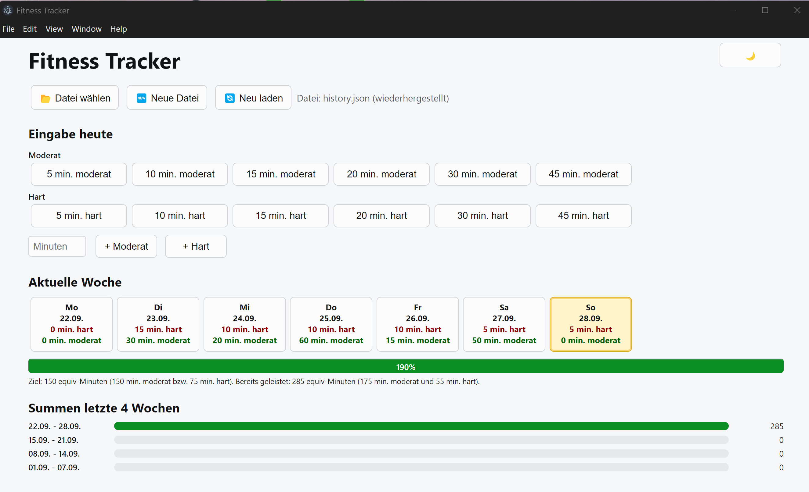

# Fitness Tracker (Electron)

A local desktop app (Windows and other platforms) to record training minutes:
- Two intensity levels: hard / moderate
- Goal: 150 minutes moderate or 75 minutes hard (1 hard = 2 moderate) per week
- Quick buttons for common durations (5, 10, 15, 20, 30, 45 minutes)
- Progress bar for the current week
- 4-week history (moderate-equivalents)
- Stored in a user-chosen JSON/TXT file (an array of entries)
- Remembers the last chosen file (in the app config under the user profile)
- Toggleable Dark Mode (🌙 / ☀️) — setting persists across restarts

## Screenshot



## Data format
Entries are stored as an array:
```json
[
  { "date": "2025-09-27", "type": "moderate", "minutes": 30 },
  { "date": "2025-09-27", "type": "hard", "minutes": 15 }
]
```

## Usage
1. Install dependencies
```bash
npm install
```
2. Start the app
```bash
npm start
```
Windows: run "Start Fitness-Tracker.vbs".
3. Click the "Choose file" button and select an existing or new (empty) .json / .txt file.
4. Add entries using the quick buttons or the free minutes field.
5. Optionally toggle Dark Mode using the button on the right of the title bar (🌙/☀️).
6. Data is saved automatically.

## Folder structure (key files)
- `main.js` – Electron main process, window creation & file/config IPC
- `preload.js` – secure bridge layer (`contextIsolation` enabled)
- `index.html` – UI + theme toggle
- `renderer.js` – UI logic / rendering / theme handling
- `package.json` – project and script definitions

## Security notes
- `contextIsolation: true`, no direct Node.js access in the renderer
- IPC is limited to necessary file and theme functions

## Packaging (optional)
No packager is configured currently. To add a packager you can use e.g. `electron-builder`:
```bash
npm install --save-dev electron-builder
```
Adjust `package.json` (example):
```json
{
  "build": { "appId": "de.example.fitness-tracker" }
}
```
Then:
```bash
npx electron-builder
```

## Further ideas
- Delete / undo individual entries (with a UI dialog)
- Internationalization
- Optimize for smaller windows

License: The Unlicense (Public Domain)
