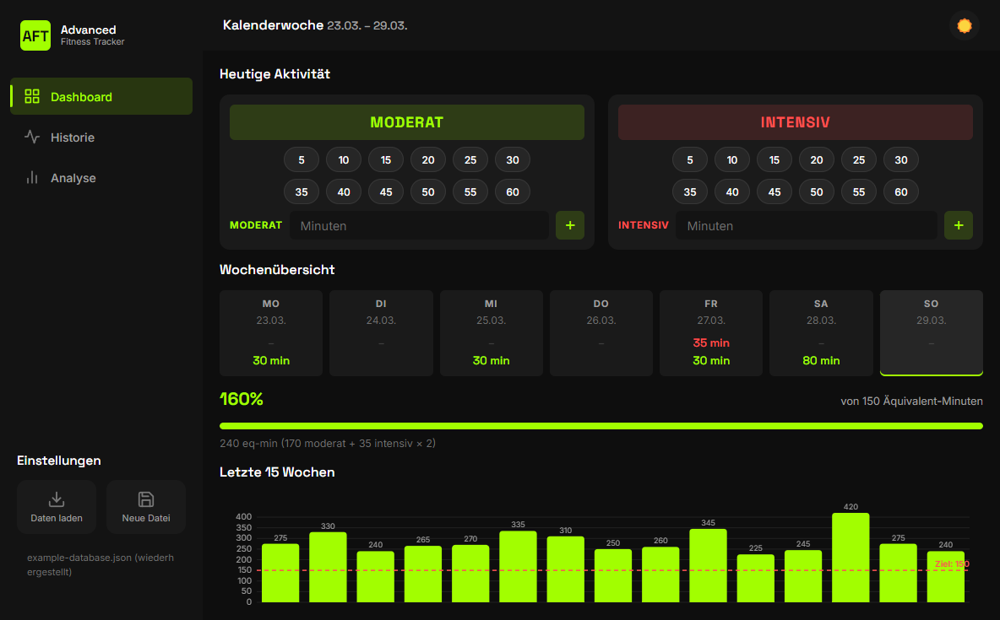
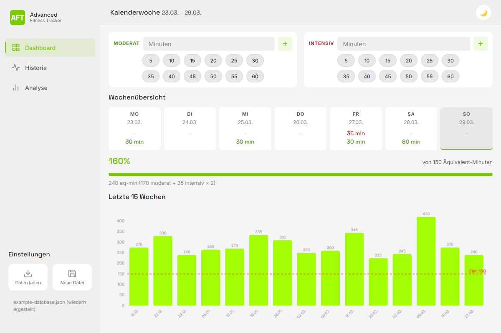
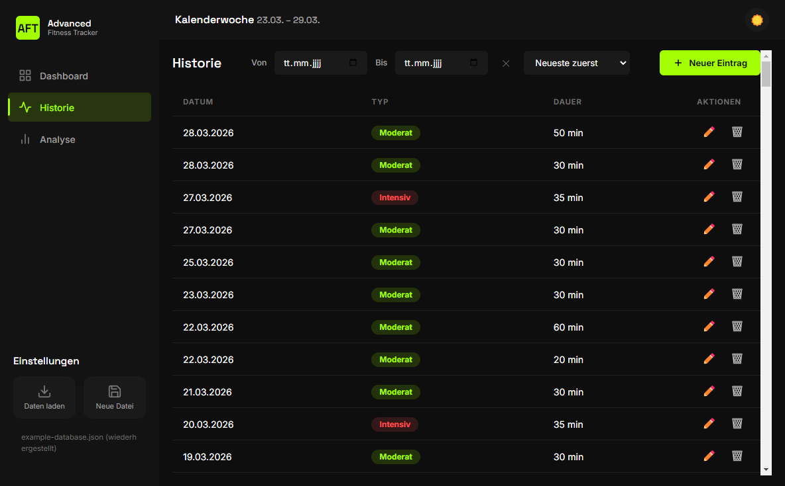
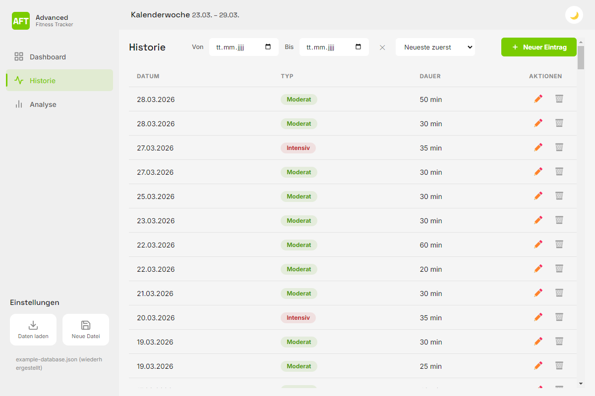
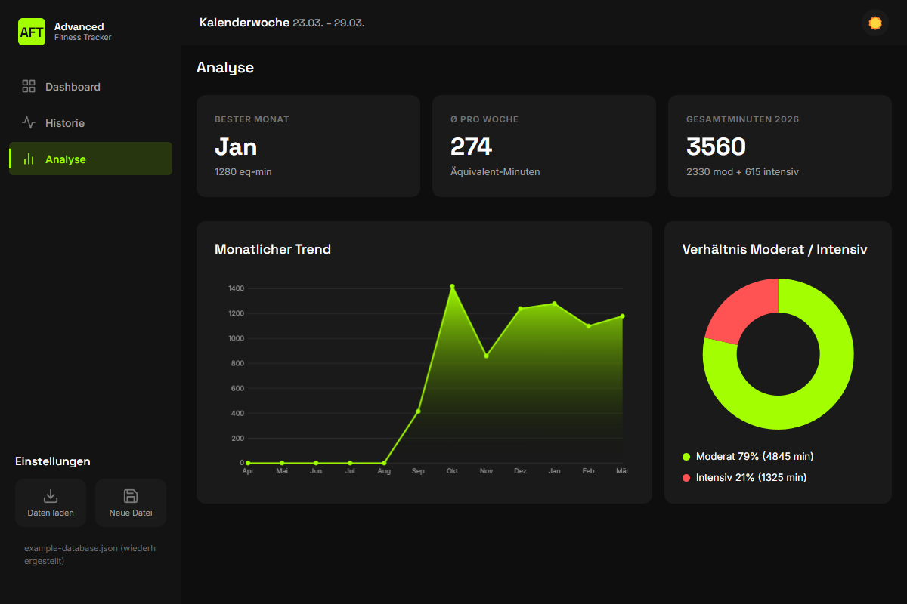
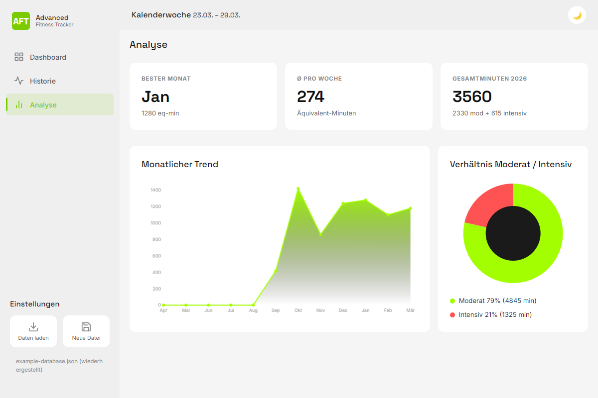

# Fitness Tracker (Electron) — Advanced Fitness Tracker

A local desktop app (Windows and other platforms) to record training minutes with a modern "Kinetic Volt" design:

- **Three views** via sidebar navigation: Dashboard, Historie (History), Analyse
- Two intensity levels: intensiv (hard) / moderat (moderate)
- Goal: 150 minutes moderate or 75 minutes hard (1 hard = 2 moderate) per week
- Quick-add cards for common durations (5 to 60 minutes)
- Progress bar with percentage for the current week
- 15-week bar chart (moderate-equivalents), auto-scaling
- **History view**: Full CRUD — view, add, edit, delete individual entries with inline editing, filter by type, sort by date/minutes
- **Analyse view**: Key stats (best month, weekly average, yearly total), monthly trend line chart, moderate/intensive ratio donut chart
- Stored in a user-chosen JSON/TXT file (an array of entries)
- Remembers the last chosen file (in the app config under the user profile)
- Toggleable Dark/Light Mode — setting persists across restarts
- Automatic refresh shortly after midnight

## Screenshots

### Dashboard (Dark / Light)



### History (Dark / Light)



### Analyse (Dark / Light)




## Data format
Entries are stored as an array:
```json
[
  { "date": "2025-09-27", "type": "moderate", "minutes": 30 },
  { "date": "2025-09-27", "type": "hard", "minutes": 15 }
]
```

## Usage
1. Install dependencies
```bash
npm install
```
2. Start the app
```bash
npm start
```
Windows: run "Start Fitness-Tracker.vbs".

3. Use the sidebar to navigate between Dashboard, Historie, and Analyse views.
4. **Dashboard**: Add entries using the quick-add cards (Moderat / Intensiv). For custom minutes, type in the input field and click +. View week overview, progress bar, and 15-week chart.
5. **Historie**: View all entries sorted by date. Use filters and sorting. Click ✏️ to edit inline, 🗑️ to delete, or "Neuer Eintrag" to add.
6. **Analyse**: View statistics, monthly trend chart, and type ratio.
7. **Einstellungen** (sidebar bottom): Load/create data files.
8. Data is saved automatically on every change.

## Folder structure (key files)
- `main.js` – Electron main process, window creation & file/config IPC
- `preload.js` – secure bridge layer (`contextIsolation` enabled)
- `index.html` – UI layout (sidebar, 3 views, header)
- `renderer.js` – UI logic, view routing, rendering, charts, history CRUD
- `styles.css` – Kinetic Volt design system (CSS custom properties, dark/light themes)
- `package.json` – project and script definitions
- `example-database.json` – example database
- `screenshot-helper.js` – automated screenshot capture for all views/themes
- `node_modules/@fontsource/` – bundled fonts (Space Grotesk, Inter)

## Design System
The app uses the "Kinetic Volt" design system:
- **Fonts**: Space Grotesk (headlines), Inter (body) — bundled locally
- **Dark theme** (default): Surface hierarchy from `#0E0E0E` to `#262626`, neon green accent `#A2FE00`
- **Light theme**: Light surfaces, darker green accent `#7ACC00`
- **No-Line Rule**: Structure through surface tone changes, not borders
- CSS custom properties for all tokens in `styles.css`

## Security notes
- `contextIsolation: true`, no direct Node.js access in the renderer
- IPC is limited to necessary file and theme functions

## Packaging (optional)
No packager is configured currently. To add a packager you can use e.g. `electron-builder`:
```bash
npm install --save-dev electron-builder
```
Adjust `package.json` (example):
```json
{
  "build": { "appId": "de.example.fitness-tracker" }
}
```
Then:
```bash
npx electron-builder
```

License: The Unlicense (Public Domain)
